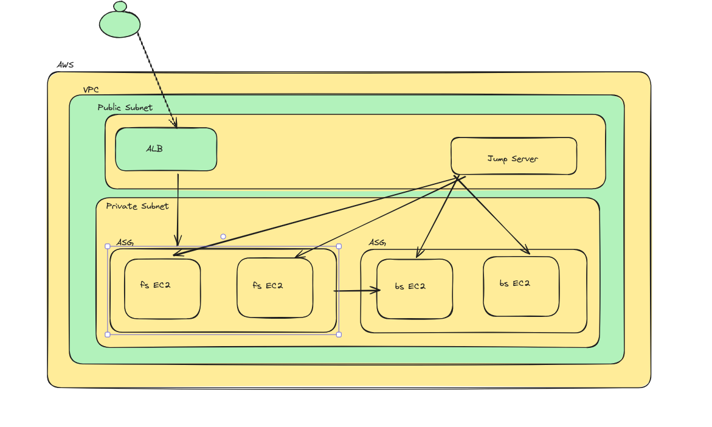

## Decided to deploy given 2-tier application on AWS

### Prepared Diagram 



Architecture Overiew:

- AWS Services 
    - VPC
    - EC2
    - ASG
    - ALB


- Created VPC
    - 2 Private Subnet
    - 1 Public Subnet
    - 1 IG
    - 1 NG
    - Cutom Route Table

- EC2 Instances
    - 2 EC2 in private subnet
    - 1. Backend service 
    - 2. Frontend Service

- Created ASG
    - 2 Asg for saperate frontend and backend service
    - Taken AMI for the running server
    - prepared Launch template for both the services 
    - Created ASG for the services

- Create ALB - Public
    - Create Launch template which targets to the frontend instances.
    - Create ALB with this target group as a target.

    ```
    Note: Choose EC2 for both services for front end we can use some other services as well to serve static content but as a devops need to think on security part and also need to optimize costs. not sure we might have to pay more for managed services also security is not in our hand. 
    
    If choose EC2 then we cusotmize and take other steps for security such as iptables firewall which came wiht linux server for blocking inbound and outbound security for one more security layer whihc is inside server. can keep monitoring with installing some monitoring tool over the instance and lot many things

    Definetly managed service can easy for us and we need not do all this stuff even few things alredy come up with this managed services.

    ```
### Tasks that I have performed in-flow.


- Created VPC
- Created Subnets
- Internetgateway
- Nat gateway 
- Created cutom routtbale for NatGW entry and attached it to the private subnets.
- Created 2 private instances 
- Creted 1 public jump server to access these private servers
- Go to the servers (ssh) using below ssh configs
    ```
    Host mgr.server
        HostName A.B.C.D
        User ec2-user
        Port 22
        IdentitiesOnly yes
        IdentityFile <key>.pem

    Host bs.server
        HostName A.B.C.D
        User ec2-user
        port 22
        IdentityFile <key>.pem
        IdentitiesOnly yes
        ProxyJump mgr.server

    Host fs.server
        HostName A.B.C.D
        User ec2-user
        port 22
        IdentityFile <key>.pem
        IdentitiesOnly yes
        ProxyJump mgr.server
    ```
- Install required things node, npm, git and all and startd node application on frontend server

- Installed required things python and all on backend server and run the application 

- As fronend service is running in private server so for accessing it setup ssh tunnuling for the same to access that service from localhost to verify the connectivity.

    ```
    ssh -L 3000:fron-end-server-ip:3000 -N -i <key>.pem ec2-user@jump-server-ip -v
    ```

- Able to access the frontend of application still facing issue with backend service so change configs as mentioned in repo for backendURL but still backend was not responding.

- checked all troubleshooting step that I could using telnet checked connectivity but it could not so checked listning ports on backend using ss command but it's not up. even checked applicaiton code for service that but no luck.

- Started with ASG part build the application and taken AMI.

- Created Launch template for both the ASG and then created ASG.

- Now new instances running anad up for both frontend and backend both.

- Created public facing applicaiton load balancer and target group through which we can access frontend instances which are running behind ASG.
